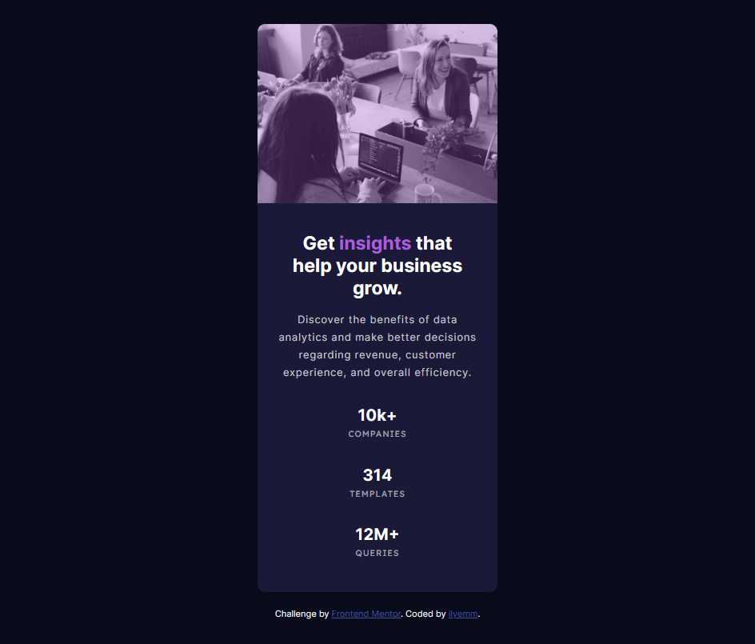

# Frontend Mentor - Stats preview card component solution

This is a solution to the [Stats preview card component challenge on Frontend Mentor](https://www.frontendmentor.io/challenges/stats-preview-card-component-8JqbgoU62). Frontend Mentor challenges help you improve your coding skills by building realistic projects. 

## Table of contents

- [Overview](#overview)
  - [The challenge](#the-challenge)
  - [Screenshot](#screenshot)
  - [Links](#links)
- [My process](#my-process)
  - [Built with](#built-with)
- [Author](#author)

## Overview

### The challenge

Users should be able to:

- View the optimal layout depending on their device's screen size

### Screenshot

### Links

- Solution URL: [Frontend Mentor Solution](https://www.frontendmentor.io/solutions/using-vanilla-htmlscss-for-stats-preview-card-K46pIe_MV5)
- Live Site URL: [Github Pages](https://ilyemm.github.io/stats-preview-card/)

## My process

Same as the NFT card challenge!

### Built with

- Semantic HTML5 markup
- CSS custom properties
- Flexbox
- SCSS/SASS
- Mobile-first workflow

## Author

- Frontend Mentor - [@ilyemm](https://www.frontendmentor.io/profile/ilyemm)
